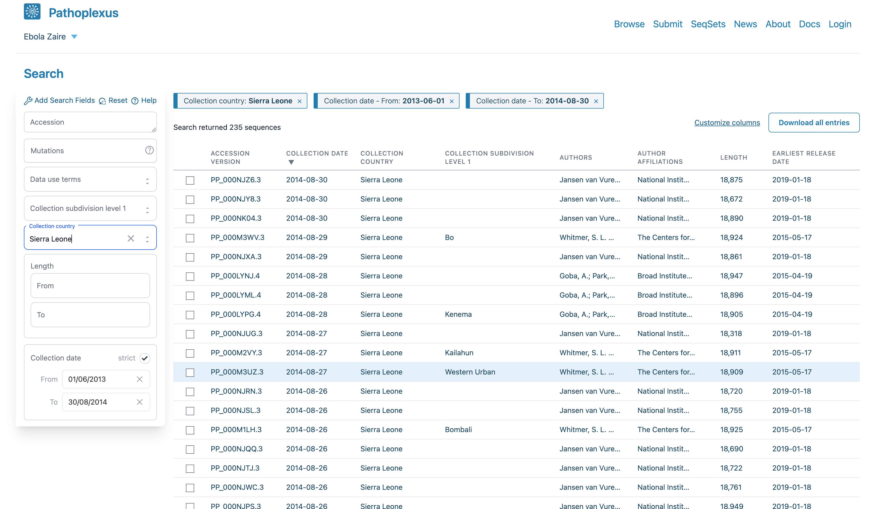

---
# **Quality control in phylogenetic analysis**
---
###### ***Trainer***: John Juma
---


## Tools and software

1. Installing conda. 

Note: We recommend installing the minimal version of conda such as miniconda or miniforge 
https://docs.conda.io/projects/conda/en/latest/user-guide/install/index.html.

> **Note**
   
   Ensure Java is installed on your computer


2. Installing AliView (https://ormbunkar.se/aliview/#DOWNLOAD)

	> **Note**

	- Install the correct executable depending on your OS

3. Installing TempEst (https://tree.bio.ed.ac.uk/software/tempest/)

	> **Note**

	- Install the correct executable depending on your OS

## Dataset 
We will construct a dataset containing about 200 Ebola virus sequences from West
Africa following the 2013-2016 epidemic. These sequences will be obtained from
Pathoplexus (https://pathoplexus.org/).

<br>
<left></left>
<br>


## Retrieving the data

We will collate data collected between June 01, 2013, and August 30, 2014 from
Sierra Leone.

<br>
<left></left>
<br>


## Setting up the project directory

Since the data has been downloaded already, we will use the copy available in
the github repository for the project.

```
cd
```

## Have a local copy of the repository on your laptop

```
git clone https://github.com/ajodeh-juma/ebov-qc.git
```

```
cd ebov-qc
```

```
mkdir -p ./{1_data,2_mafft,3_iqtree}
```


2. Inspect the data

	- **Examine the `ebov.fasta` file that you downloaded?**

    
	```
	cat ./1_data/ebov.fasta
	```
    
    - **How many sequences are in the `ebov.fasta` file**


	```
	grep '>' ./1_data/ebov.fasta | wc -l
	```
        
    - **How many records are in the metadata `ebov_metadata.tsv` file**


	```
	wc -l ./1_data/ebov_metadata.tsv
	```
        
    - **What is the shortest sequence length in the metadata record `ebov_metadata.tsv`**
    
    - **What is the longest sequence length in the metadata record `ebov_metadata.tsv`**
    
    - **How many sequences have a length of 18921 bp**


It is considered good practice to have the sequence labels contain the sampling times, which enables **TempEst** to extract these sampling times from the sequence labels after providing the date format. 

## Manipulate the data

We will manipulate the data using `seqkit` (https://github.com/shenwei356/seqkit) to generate sequence headers with accessions and sampling dates

1. Create a `conda` environment names `seqkit` and install both `seqkit` and `csvtk`. If you installed `miniforge` or `miniconda` use `mamba` for creation and installation of `seqkit` and `csvtk`


```
conda create -n seqkit -c conda-forge -c bioconda seqkit csvtk
```

```
conda activate seqkit
```

2. We will extract the sequence ID using `seqkit seq` subcommand and manipulate the extracted IDs using `csvtk`

```
seqkit seq -n -i ./1_data/ebov.fasta > ./1_data/accessions.txt
```

```
tail -n+2 ./1_data/ebov_metadata.tsv | cut -f1,11 > ./1_data/accessions_dates.txt
```

```
csvtk join -H -t ./1_data/accessions.txt ./1_data/accessions_dates.txt > ./1_data/accessions_keypairs.txt
```

```
seqkit replace -p "(.+)" -r '$1|{kv}' -k ./1_data/accessions_keypairs.txt ./1_data/ebov.fasta > ./1_data/ebov_renamed.fasta
```

```
conda deactivate
```

## Multiple sequence alignment
We will align the collected data using `MAFFT` (Nakamura et al. 2018) followed by manual curation in `AliView` (Larsson, 2014).


```
conda create -n mafft -c conda-forge -c bioconda mafft

```

```
conda activate mafft
```

```

mafft --thread 4 ./1_data/ebov_renamed.fasta > ./2_mafft/ebov_aln.fasta

```

```
conda deactivate
```


## Manually check the alignment and deduplicate sequences
We will assess the alignment in `AliView` to identify any issues.


> **Note**

- If you had downloaded the program file as given in the installation part:

	Start the `AliView` Program and load the alignment file `ebov_aln.fasta`


- If you **were unable** to download AliView with the program files depending on your OS,
	You can use `conda`

	- create a conda environment
	```
	conda create -n aliview -c conda-forge -c bioconda aliview
	```

	- activate the environmenta

	```
	conda activate aliview
	```

	- start the program and load the alignment file `ebov_aln.fasta`
	```
	aliview
	```


<br>
<left></left>
<br>


We will then remove duplicate sequences using `seqkit`.

```
conda activate seqkit
```

```
seqkit rmdup -s -D  ./2_mafft/duplicates.txt < ./2_mafft/ebov_aln.fasta > ./2_mafft/ebov_dedup_aln.fasta
```
**How many duplicated records are in the alignment? List the accessions of the duplicated records**

```
conda deactivate
```


## Maximum Likelihood tree inference

We will use `IQTREE` (Nguyen et al., 2014) to generate a maximum likelihood phylogenetic tree


```
conda create -n iqtree -c conda-forge -c bioconda iqtree
```

```
conda activate iqtree
```

```
iqtree -s ./2_mafft/ebov_dedup_aln.fasta -m HKY -T 4 -bb 1000 -redo --prefix ./3_iqtree/ebov
```

```
conda deactivate
```


## Assess the temporal signal in the data

Assessing the Temporal signal in the data using TempEst (Rambaut et al., 2016)

For molecular clock analysis, the sequence data should have sufficient temporal signal over time. We assess this temporal signal to identify issues such as laboratory contamination or mislabelling. This preliminary descriptive analysis is helpful in **identifying outlier samples** and should be a **routine procedure** before committing to a potentially time-consuming analysis.

Start TempEst and load the `ebov.treefile`, a 'nonclock' maximum likelihood tree where the branch lengths are scaled at genetic distances) then click **Open**
Once the tree has been loaded into TempEst, click on the **Sample Dates** tab at the top of the screen. Click on the **Parse Dates** button to bring up a window that allows to provide a sampling time for each sequence in the alignment.


To parse the dates in the sequence labels, we select **Defined by a prefix and its order**, select last from the **Order** drop-down menu and input **|** in the box by **Prefix**. This informs TempEst that the date is the last element in the label, preceded by a pipe (**|**). Select **Parse as a calendar date** and ensure that the Date format box is set correctly to **yyyy–MM–dd**


<br>
<left></left>
<br>


The tree is visualized in the **Tree** panel of TempEst, but of primary interest are the **Root-to-tip** and the **Residuals** panels. In the **Root-to-tip** panel, we see the plot of a regression analysis of genetic divergence from the root of the tree against time of sampling, with each dot representing a time-stamped sequence. Initially, the tree is rooted arbitrarily, so we select the **Best-fitting root** button in the top left to select a root which minimizes the mean of the squares of the residuals.

<br>
<left></left>
<br>


Additionally, an objective but informal measure of the temporal signal is given by the correlation coefficient R2, but this should not be used to test the statistical significance of the regression. 

The **slope** of the regression line provides an **estimate of the rate of evolution in substitutions per site per year** while the **intercept** with the time-axis constitutes an **estimate of the age of the root**. 


Importantly, both the plot in the Root-to-tip panel and the plot in the Residuals tab allow us to identify sequences whose sampling date is incongruent with their genetic divergence.
All lie above the regression line and therefore are more genetically divergent than we would have expected based on their sampling times. This may be due to several reasons, such as errors in the sequence assembly or an alignment error in part of the sequence.
Regardless of the underlying explanation, it is common practice to exclude such sequences from the multiple sequence alignment for the remainder of the analysis.

- **How many sequences are showing a greater variance from the regression line? Are these potentially outlier sequences**


## Remove outlier sequences

- Under the **Root-to-tip** panel, highlight the sequences with higher variance.
- Navigate to the **Tree** panel and copy the highlighted sequences. 


```
conda activate seqkit
```

```
seqkit grep -v -f ./outliers.txt ./2_mafft/ebov_dedup_aln.fasta > ./3_iqtree/ebov_aln_clean.fasta
```

```
conda deactivate
```


## Rerun the maximum likelihood phylogenetic tree inference

```
conda activate iqtree
```

```
iqtree -s ./3_iqtree/ebov_aln_clean.fasta -m HKY -T 4 -bb 1000 -redo --prefix ./3_iqtree/ebov_clean
```

## Visual the temporal signal of the new tree

- What is the substitution rate of the Ebola sequences following exclusion of potential outliers?
- When did the Ebola outbreak of in Sierra Leone start?

Compare your results with what was reported by Dudas and Rambaut 2014 and Dudas et al. 2017.
